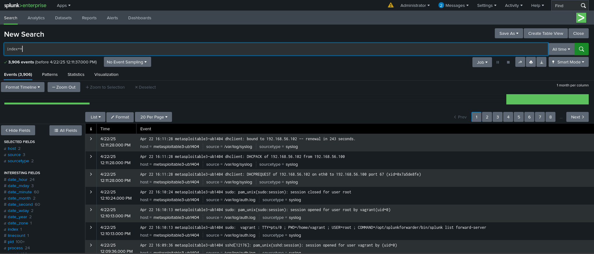
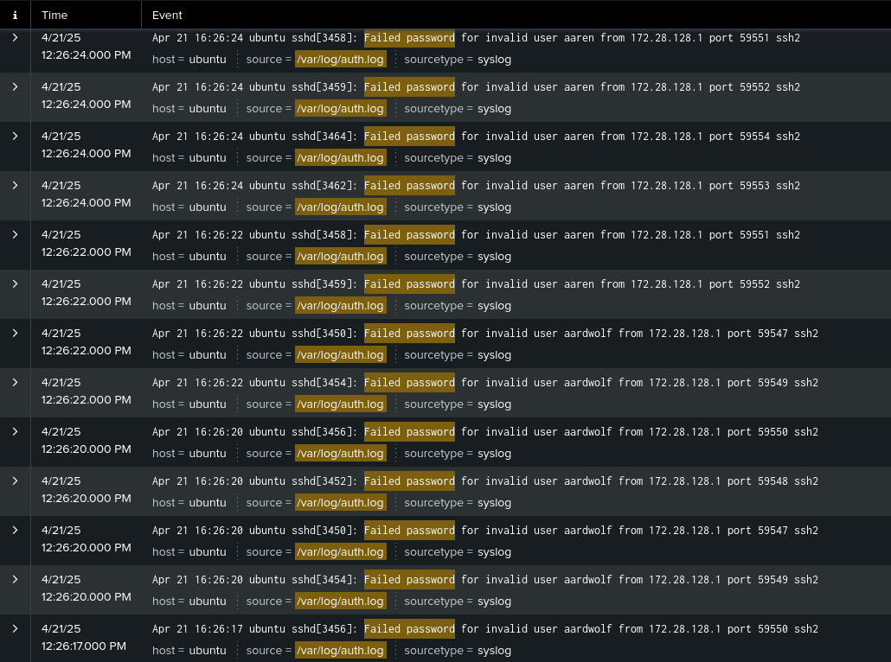
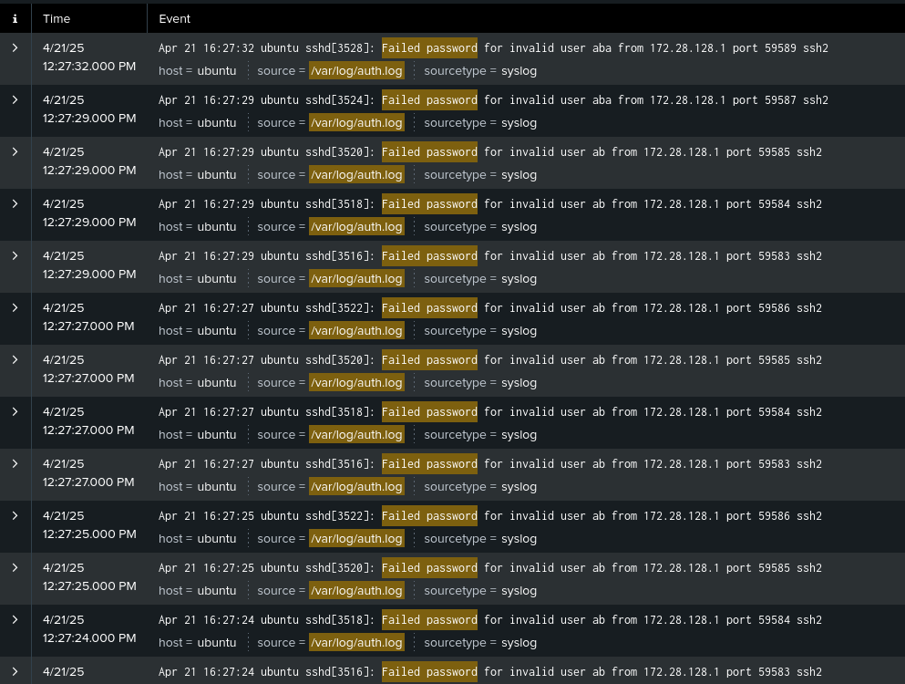
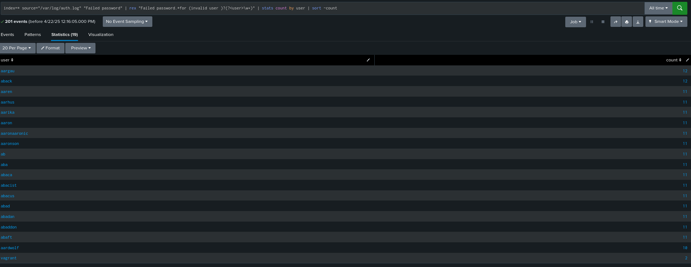
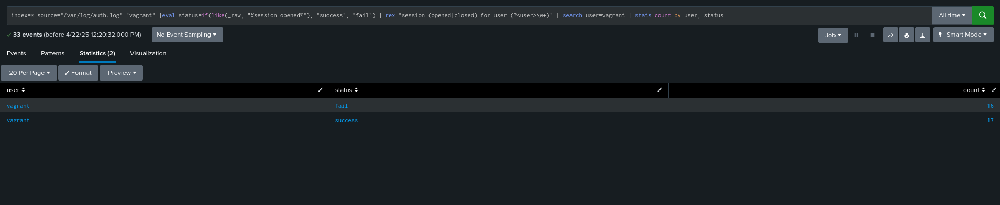

**Metasploitable3 Log Forwarding to Kali Linux Using Splunk**

**Step 1: Install Splunk Enterprise on Kali Linux (SIEM)**
1. **Download Splunk Enterprise .deb Package:**

```
wget -O splunk-9.3.2-d8bb32809498-linux-2.6-amd64.deb https://download.splunk.com/products/splunk/releases/9.3.2/linux/splunk-9.3.2-d8bb32809498-linux-2.6-amd64.deb
```

2. **Install the Splunk Package:**

```
sudo dpkg -i splunk-9.3.2-d8bb32809498-linux-2.6-amd64.deb
```

3. **Fix Broken Dependencies (if needed):**

```
sudo apt --fix-broken install
```

4. **Start Splunk for the First Time:**

```
sudo /opt/splunk/bin/splunk start --accept-license
```

5. **Set Admin Password When Prompted**

6. **Enable Splunk at System Boot:**

```
sudo /opt/splunk/bin/splunk enable boot-start
```

**Step 2: Configure Splunk Web Interface**
1. **Access Splunk Web Interface:**
   * Open your browser and navigate to:

```
http://<kali-linux-ip>:8000
```

2. **Log in with Your Credentials:**
   * **Username:** `admin`
   * **Password:** The one you set during installation

3. **Enable Receiving Port for Forwarders:**
   * Navigate to **Settings** → **Forwarding and receiving**
   * Under **Receive data**, click **Configure receiving**
   * Click **New Receiving Port** and enter `9997`
   * Click **Save**

**Step 3: Install Splunk Universal Forwarder on Metasploitable3**
1. **Download Splunk Universal Forwarder:**

```
wget -O splunkforwarder-9.3.2-d8bb32809498-Linux-amd64.deb https://download.splunk.com/products/universalforwarder/releases/9.3.2/linux/splunkforwarder-9.3.2-d8bb32809498-Linux-amd64.deb
```

2. **Install the Forwarder Package:**

```
sudo dpkg -i splunkforwarder-9.3.2-d8bb32809498-Linux-amd64.deb
```

3. **Fix Any Broken Dependencies:**

```
sudo apt --fix-broken install
```

4. **Start Splunk Forwarder and Accept the License:**

```
sudo /opt/splunkforwarder/bin/splunk start --accept-license
```

5. **Create Admin User When Prompted**

**Step 4: Configure Splunk Forwarder on Metasploitable3**
1. **Connect Forwarder to Splunk Server on Kali Linux:**

```
sudo /opt/splunkforwarder/bin/splunk add forward-server <kali-linux-ip>:9997
```

2. **Add the Target Log Files as Inputs:**

```
sudo /opt/splunkforwarder/bin/splunk add monitor /var/log/auth.log -sourcetype linux_auth
sudo /opt/splunkforwarder/bin/splunk add monitor /opt/cowrie/var/log/cowrie.log -sourcetype cowrie_honeypot
```

3. **Restart the Forwarder to Apply Changes:**

```
sudo /opt/splunkforwarder/bin/splunk restart
```

**Step 5: Enable Forwarder on System Boot**

```
sudo /opt/splunkforwarder/bin/splunk enable boot-start
```

**Step 6: Create Indexes in Splunk (Optional but Recommended)**
1. **Access Splunk Web Interface on Kali Linux:**

```
http://<kali-linux-ip>:8000
```

2. **Create Custom Indexes:**
   * Navigate to **Settings** → **Indexes**
   * Click **New Index**
   * Create two indexes:
     * Name: `metasploitable_auth` for authentication logs
     * Name: `cowrie_honeypot` for honeypot logs
   * Click **Save** for each

3. **Update Inputs Configuration on Metasploitable3:**

```
sudo /opt/splunkforwarder/bin/splunk add monitor /var/log/auth.log -sourcetype linux_auth -index metasploitable_auth
sudo /opt/splunkforwarder/bin/splunk add monitor /opt/cowrie/var/log/cowrie.log -sourcetype cowrie_honeypot -index cowrie_honeypot
```

**Verify the Setup**
1. **Check the Forwarder Status on Metasploitable3:**

```
sudo /opt/splunkforwarder/bin/splunk list forward-server
```

2. **Check Data in Splunk Enterprise (Web Interface):**
   * Navigate to:

```
http://<kali-linux-ip>:8000
```

   * Go to **Search & Reporting**
   * Run the following searches to verify data is being received:
     * `index=metasploitable_auth` (or `sourcetype=linux_auth`)
     * `index=cowrie_honeypot` (or `sourcetype=cowrie_honeypot`)

**Security Tips**
1. **Firewall Configuration on Kali Linux:**

```
sudo ufw allow 8000/tcp   # Allow Splunk Web Interface
sudo ufw allow 9997/tcp   # Allow Forwarder Traffic
```

2. **Firewall Configuration on Metasploitable3:**

```
sudo ufw allow out to <kali-linux-ip> port 9997 proto tcp
```

3. **Enable Secure Communication with SSL:**
   * Follow the Splunk documentation for securing forwarder communication:
   * https://docs.splunk.com/Documentation/Splunk/latest/Security/ConfigureSplunkforwardingtousesignedcertificates

**Useful Splunk Searches**
* **Failed SSH Authentication Attempts:**

```
index=metasploitable_auth "Failed password"
```

* **Successful SSH Logins:**

```
index=metasploitable_auth "Accepted password"
```

* **Cowrie Honeypot Connection Attempts:**

```
index=cowrie_honeypot "New connection"
```

* **Cowrie Command Execution:**

```
index=cowrie_honeypot "Command found"
```

## Proof 
 
### Splunk Logs



### Hydra Attempts



### Scri[t Attempts



### Numper of Failed Attempts



### Vagrant Fail & Success Attempts using a splunk Query

#### Query: 

```
index=metasploitable_auth sourcetype=linux_auth "vagrant" 
| eval login_status=case(match(_raw, "Failed password"), "Failed", match(_raw, "Accepted password"), "Successful") 
| where login_status="Failed" OR login_status="Successful" 
| stats count by login_status 
| rename count as "Login Attempts"
```



