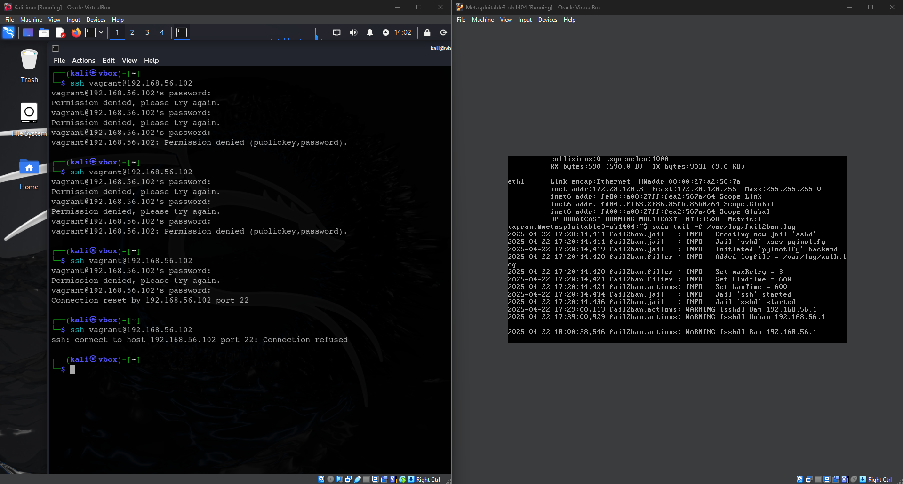
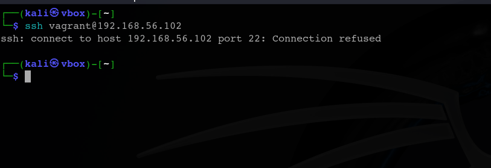
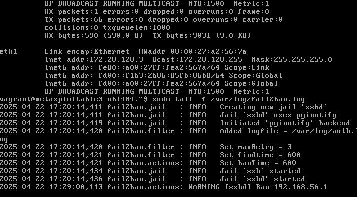
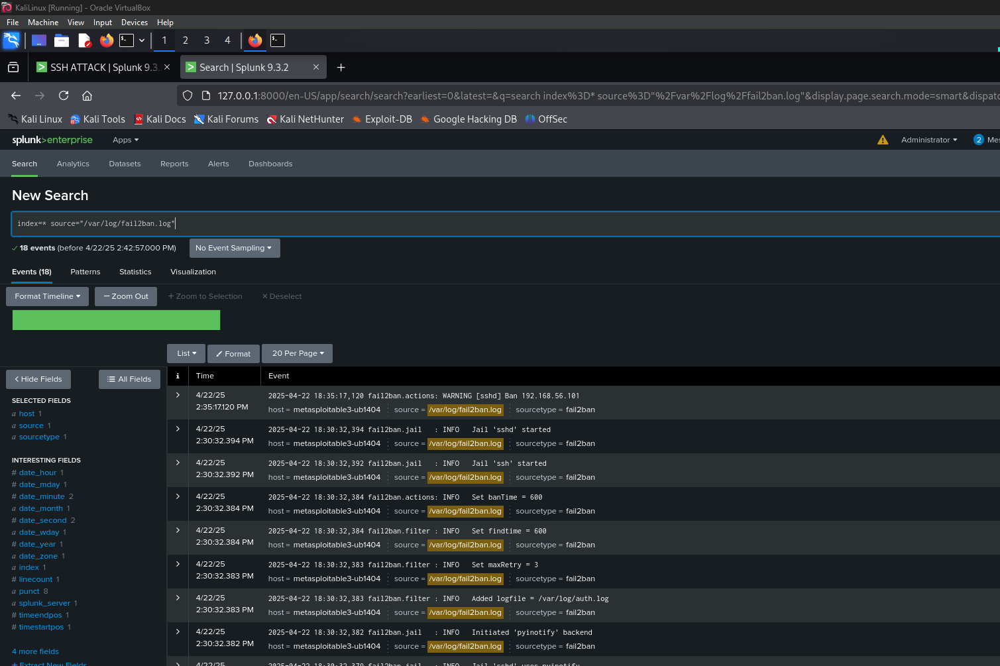
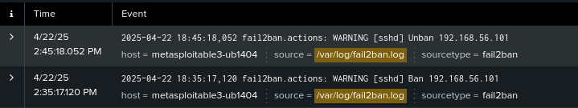
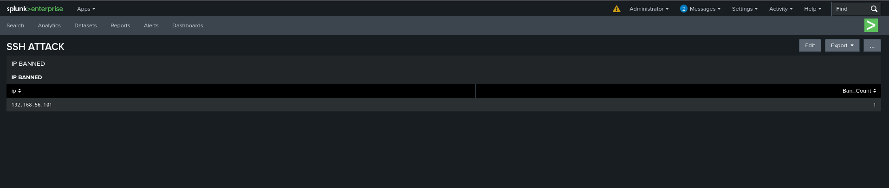

# Fail2ban and Cowrie Installation Guide

This README provides installation instructions for setting up Fail2ban on Metasploitable3 and Cowrie SSH honeypot on Kali Linux.

## Fail2ban Installation on Metasploitable3

Fail2ban is an intrusion prevention software that protects servers from brute-force attacks by temporarily banning IPs that show malicious behavior.

### Installation Steps

```bash
# Update system packages
sudo apt-get update

# Install Fail2ban
sudo apt-get install -y fail2ban

# Create a copy of the configuration file
sudo cp /etc/fail2ban/jail.conf /etc/fail2ban/jail.local

# Edit the configuration file
sudo nano /etc/fail2ban/jail.local
```

### Basic Configuration

Edit your `jail.local` file to include this SSH configuration:

```
[sshd]
enabled = true
port = ssh
filter = sshd
logpath = /var/log/auth.log
maxretry = 3
bantime = 3600
findtime = 600
```

### Start Fail2ban

```bash
# Restart the service to apply changes
sudo systemctl restart fail2ban

# Enable at system startup
sudo systemctl enable fail2ban

# Check status
sudo systemctl status fail2ban
```

### Verifying It Works

```bash
# Check Fail2ban status
sudo fail2ban-client status

# Check SSH jail status specifically
sudo fail2ban-client status sshd

# View logs
sudo tail -f /var/log/fail2ban.log
```

### Common Commands

```bash
# Ban an IP manually
sudo fail2ban-client set sshd banip 192.168.1.100

# Unban an IP manually
sudo fail2ban-client set sshd unbanip 192.168.1.100

# View all banned IPs
sudo fail2ban-client get sshd bannedip
```

## Cowrie SSH Honeypot Installation on Kali Linux

Cowrie is an SSH and Telnet honeypot designed to log brute force attacks and shell interaction performed by attackers.

### Prerequisites

```bash
# Update system
sudo apt update && sudo apt upgrade -y

# Install dependencies
sudo apt install -y git python3-virtualenv libssl-dev libffi-dev build-essential libpython3-dev python3-minimal authbind virtualenv
```

### Installation

```bash
# Create a dedicated user for Cowrie
sudo adduser --disabled-password cowrie

# Switch to the cowrie user
sudo su - cowrie

# Clone the Cowrie repository
git clone https://github.com/cowrie/cowrie.git
cd cowrie

# Create and activate a virtual environment
python3 -m virtualenv cowrie-env
source cowrie-env/bin/activate

# Install Cowrie requirements
pip install --upgrade pip
pip install --upgrade -r requirements.txt
```

### Configuration

```bash
# Create a configuration file
cp etc/cowrie.cfg.dist etc/cowrie.cfg

# Edit the configuration file
nano etc/cowrie.cfg
```

Important configuration options to modify in `cowrie.cfg`:

```
[ssh]
enabled = true
listen_endpoints = tcp:2222:interface=0.0.0.0
version = SSH-2.0-OpenSSH_7.9p1 Ubuntu-10

[telnet]
enabled = false

[honeypot]
hostname = svr04
```

### Port Forwarding (as root user)

Exit the cowrie user session and run these commands as root:

```bash
# Forward incoming SSH connections to Cowrie port
sudo iptables -t nat -A PREROUTING -p tcp --dport 22 -j REDIRECT --to-port 2222

# Make iptables rules persistent
sudo apt-get install -y iptables-persistent
sudo netfilter-persistent save
```

### Starting Cowrie

Return to the cowrie user and start the honeypot:

```bash
# Switch back to cowrie user if needed
sudo su - cowrie
cd cowrie

# Start Cowrie
bin/cowrie start

# Check logs
tail -f var/log/cowrie/cowrie.log
```

### Managing Cowrie

```bash
# Start Cowrie
bin/cowrie start

# Stop Cowrie
bin/cowrie stop

# Restart Cowrie
bin/cowrie restart

# Check status
bin/cowrie status
```

### Viewing Captured Data

```bash
# View log files
tail -f var/log/cowrie/cowrie.log

# View JSON logs with more detailed information
tail -f var/log/cowrie/cowrie.json

# Downloaded files are stored in
ls -la var/lib/cowrie/downloads/

# Cowrie captures attacker sessions in
ls -la var/lib/cowrie/tty/
```

### Proofs:

#### Band and Unban



#### Blocking an IP



#### Proof of ban




#### Fail2ban Logs on splunk



#### Ban Unban on splunk



#### List of banned IPs on Splunk using a query




## Testing Your Setup

### Testing Fail2ban
1. Attempt multiple failed SSH logins to Metasploitable3
2. Check if your IP was banned: `sudo fail2ban-client status sshd`

### Testing Cowrie
1. Connect to your Kali Linux machine from another system
2. Try common credentials like admin:admin, root:root
3. Check Cowrie logs to see the captured session: `tail -f var/log/cowrie/cowrie.log`
